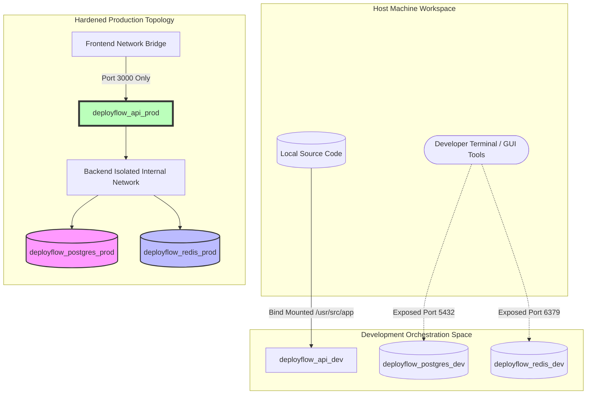

# DeployFlow Enterprise Containerization Operations Manual

This document details the container architecture, security boundaries, and multi-environment orchestration topologies for the DeployFlow platform.

## 1. Container Infrastructure Architecture Blueprint

DeployFlow balances rapid local development with zero-trust production container hardening.



## 2. Hardened Production Dockerfile Breakdown

The production image compilation uses a multi-stage architecture to drop compilers and development packages, resulting in a minimal, highly secure production footprint.

### Stage 1: Build & Compilation Workspace
*   **Base Target:** `node:22.6.0-alpine3.20`
*   **Responsibility:** Installs system prerequisites (`openssl`, `libc6-compat`), provisions all packages via deterministic locks (`npm ci`), generates platform-specific Prisma engines (`linux-musl-openssl-3.0.x`), and compiles source assets.
*   **Pruning:** Runs `npm prune --production` to clear heavy development tools before migrating assets to the final stage.

### Stage 2: Hardened Production Runtime Layer
*   **Base Target:** `node:22.6.0-alpine3.20`
*   **Responsibility:** Mounts compiled source directories under strict non-root user permissions (`USER 10001:10001`).
*   **Hardening:** 
    *   Enforces an immutable, read-only root filesystem configuration.
    *   Allocates a restricted memory-backed path (`/tmp`) for temporary operations.
    *   Configures an automated health monitoring probe via an explicit loop hook.

## 3. Orchestration Layer Comparison Matrix

| Architectural Feature | Development Configuration (`docker-compose.dev.yml`) | Production Hardening (`docker-compose.prod.yml`) |
| :--- | :--- | :--- |
| **Base Base Image** | Native `node:22.6.0-alpine3.20` Hub Engine Layer | Custom Compiled `deployflow:prod` Image |
| **Execution Identity** | `root` (Required for host directory sync bindings) | Unprivileged Account (`USER 10001:10001`) |
| **Filesystem Security** | Read-Write (Supports dynamic node edits) | Immutable Read-Only (`read_only: true`) |
| **Outbound Ports** | Maps `3000`, `127.0.0.1:5432`, `127.0.0.1:6379` | Maps `3000` only; DB and Cache ports omitted |
| **Network Segmentation** | Single Unified Bridge Interface Space | Multi-Tier Frontend and Isolated Backend Bridges |
| **Restart Policy** | `unless-stopped` | `always` (Enforces automatic container recovery) |

## 4. Operational Playbook & Common Tasks

The automation script wrapper (`docker/scripts/workflow.sh`) simplifies daily environment management:

### Start the Development Environment
```bash
./docker/scripts/workflow.sh dev:start
```
### Run Database Schema Migrations Locally
```bash
./docker/scripts/workflow.sh dev:migrate
```
### Seed Test Datasets
```bash
./docker/scripts/workflow.sh dev:seed
```
### Inspect Live Application Logs
```bash
./docker/scripts/workflow.sh dev:logs
```
### Deploy the Hardened Production Stack Locally
```bash
./docker/scripts/workflow.sh prod:start
```

## 5. Security & CIS Compliance Verification Controls

1.  **Administrative Account Elimination:** Run `docker exec deployflow_api_prod whoami`. The system must return user name `nonroot` or numeric identifier `10001`, proving the container is protected against root privilege exploits.
2.  **Filesystem Modification Blockades:** Run `docker exec deployflow_api_prod touch /usr/src/app/leak.js`. The container runtime must reject the command with a `Read-only file system` error.

## 6. Future Kubernetes Migration Blueprint

The configurations built in Phase 10 migrate seamlessly to production enterprise Kubernetes infrastructure:

*   **`image: deployflow:prod`** maps directly to container image specs in Kubernetes Pod manifests.
*   **`USER 10001:10001`** integrates perfectly with Kubernetes **`SecurityContext`** configurations (`runAsNonRoot: true`, `runAsUser: 10001`).
*   **`read_only: true`** maps directly to the Kubernetes pod parameter `readOnlyRootFilesystem: true`, using a temporary memory mount (`emptyDir`) bound over `/tmp`.
*   **`internal: true`** backend networking serves as the precise architectural template for creating restricted, secure Kubernetes **`NetworkPolicy`** rules.
