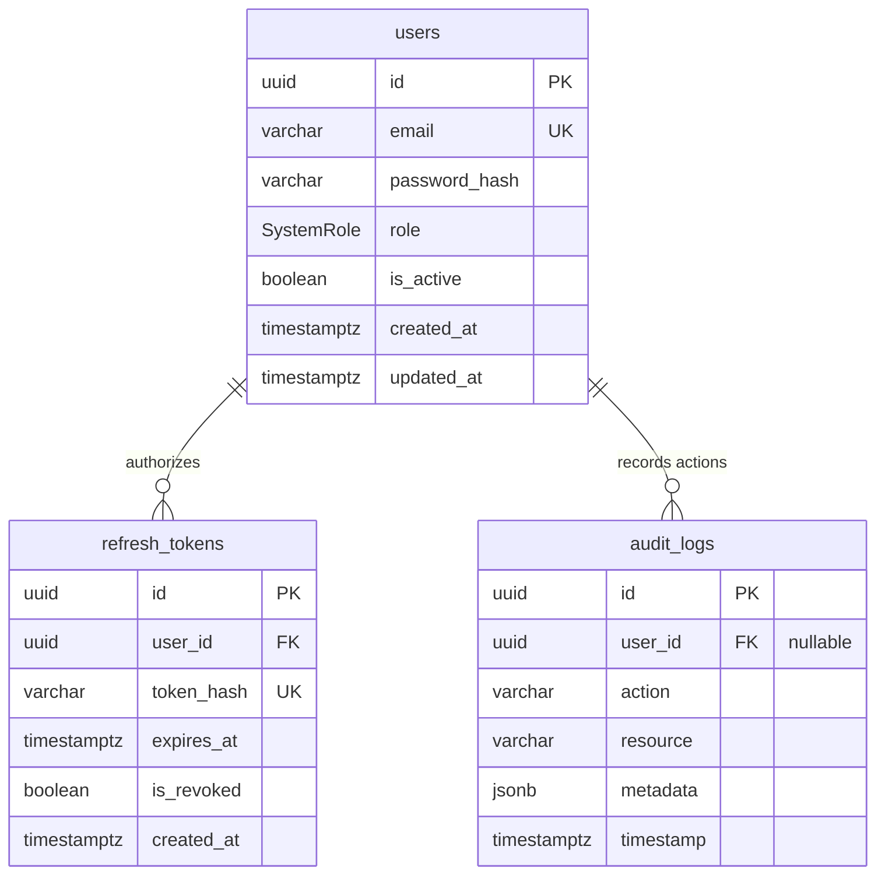

# DeployFlow Data Persistence Architecture Blueprint

This document details the relational data layer, entity design parameters, object-relational mapping, and operational persistence strategy for the DeployFlow platform.

## 1. Core Topologies & Strategy
The data architecture is engineered around transactional strictness, auditability, and connection pooling stability. We utilize PostgreSQL as our relational engine combined with Prisma ORM to provide compile-time type safety across our data boundaries.

### Entity-Relationship Diagram (Mermaid)

## 2. Table Specifications & Index Strategy

### `users` Table
Stores unique system identity references and core authorization mappings.
*   **Primary Index:** Cryptographic B-Tree UUID to eliminate numeric id guessing vectors.
*   **Unique Constraints:** B-Tree index on `email` to enforce rapid authentication reads.

### `refresh_tokens` Table
Tracks active stateless session verification hashes.
*   **Index Strategy:** Foreign key tracking on `user_id` and unique search optimization on `token_hash`.
*   **Relational Rule:** `ON DELETE CASCADE` — dropping a user purges all active session keys instantly.

### `audit_logs` Table
Immutable operational system ledger tracking critical changes across the platform.
*   **Index Strategy:** Compound index tracking `[action, timestamp]` to optimize compliance auditing queries.
*   **Data Type Tuning:** Utilizes native PostgreSQL `JSONB` for the `metadata` column, permitting microsecond searches inside nested arbitrary objects.
*   **Relational Rule:** `ON DELETE SET NULL` — preserves the integrity of compliance logs if a user is deleted.

## 3. Connection Management & Pooling Blueprint
To prevent database connection exhaustion inside dynamic container environments, connection limits are capped explicitly within environment configuration strings using the `connection_limit=10` parameter.

The application layer enforces a strict class-based **Singleton pattern** to manage this connection pool. Process hooks actively monitor standard Unix termination paths (`SIGTERM`/`SIGINT`), allowing active queries to finish processing and draining connection pools cleanly before the container exits.
