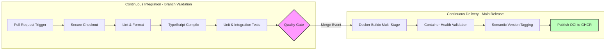

# DeployFlow Enterprise CI/CD Platform Architecture Blueprint

This document sets the technical standards and structural blueprints for the continuous integration and delivery pipelines of the DeployFlow platform.

## 1. Pipeline Execution Stages



## 2. Branching & Change Management Strategy

*   **Protected Core (`main`)**: Direct pushes are completely blocked. All code must enter the trunk branch via verified Pull Requests.
*   **Pull Request Validation Gates**: Code branch updates automatically trigger the CI workflow loop. Merging is blocked until all automated tests pass and linting checks clear perfectly.
*   **Release Isolation**: Merging a Pull Request into `main` automatically triggers the CD workflow. This tags the commit with a specific Semantic Version and publishes the container image to the enterprise registry.

## 3. Infrastructure Security Model

### Least Privilege Execution Scopes
Every workflow explicitly declares its required token scopes per job block using granular permission properties:
```yaml
permissions:
  contents: read
  packages: write
```

### Immutable Action Pinning
To mitigate supply chain threats, workflows are strictly pinned to cryptographic commit hashes rather than mutable semver tracking strings:
*   `actions/checkout` -> `pinned to validated commit SHA`
*   `actions/setup-node` -> `pinned to validated commit SHA`

### Secret Obfuscation Policy
All infrastructure keys, test passwords, and service authentication values are injected into the runner's memory at runtime using encrypted GitHub Repository Secrets. These values are automatically masked in standard runner console logs to prevent data leaks.

## 4. Future Cloud-Native Integration Steps

This CI/CD foundation provides a reliable bridge to future automated deployment workflows:
*   **Advanced Security Scanning**: Designed to cleanly integrate automated SAST (CodeQL), SCA (Trivy), and Secret Scanning tasks into the pre-merge verification phase.
*   **GitOps Delivery Syncs**: Prepares the release layer to cleanly output updated Helm charts, updating your infrastructure configurations automatically to enable continuous synchronization via ArgoCD.
