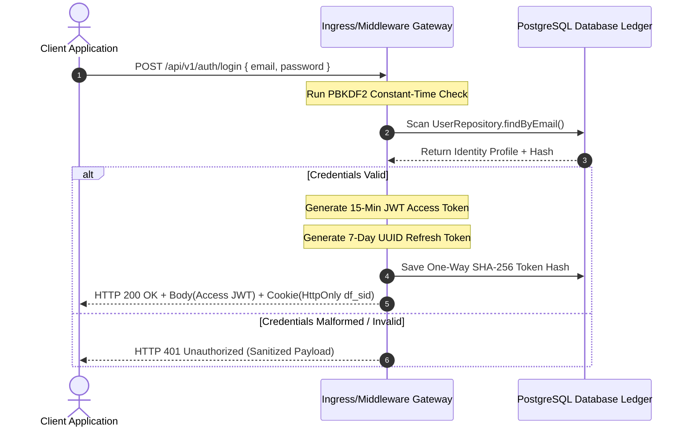

# DeployFlow Security Architecture Blueprint

This document details the complete Identity & Access Management (IAM) tier, cryptographic token lifecycles, transport security headers, and role-based access control models for the DeployFlow platform.

## 1. Authentication Sequence Flow (Mermaid)

## 2. Token Lifetime & Security Matrices

### Access Tokens (Stateless Boundary Keys)
*   **Cryptographic Primitive:** HMAC-SHA256 signatures with server-controlled algorithm freezing.
*   **Lifespan:** Strict 15-Minute expiration tracking.
*   **Transport Mechanism:** Programmatic `Authorization: Bearer <JWT>` headers.

### Refresh Tokens (Persistent Session Grips)
*   **Cryptographic Primitive:** High-entropy cryptographically secure random UUIDs.
*   **Lifespan:** 7-Day absolute session window limit.
*   **Database Storage Mask:** One-Way SHA-256 string hashes.
*   **Transport Mechanism:** Transmitted via client cookies (`HttpOnly`, `Secure`, `SameSite=Strict`, custom path-restricted endpoints).

## 3. Role-Based Access Control (RBAC) Hierarchies

The authorization subsystem enforces granular capabilities mapped through an immutable, centralized matrix tracking layout:

*   **AUDITOR:** Authorized for read-only tracking (`audit:view`, `workload:view`, `cluster:view`).
*   **DEVELOPER:** Authorized for standard lifecycle paths (`workload:view`, `workload:write`, `cluster:view`).
*   **PLATFORM_ENGINEER:** Elevated cluster configuration paths (`cluster:write`, plus developer and auditor access).
*   **ADMIN:** Universal root cluster capability matrix access (`users:write`, `users:view`, plus all sub-tier access strings).

The platform handles request checking at the route entry perimeters using a strict **fail-closed layout**. Any parsing calculation exception or internal state failure defaults to blocking the transaction with a sanitized `403 Forbidden` response.
